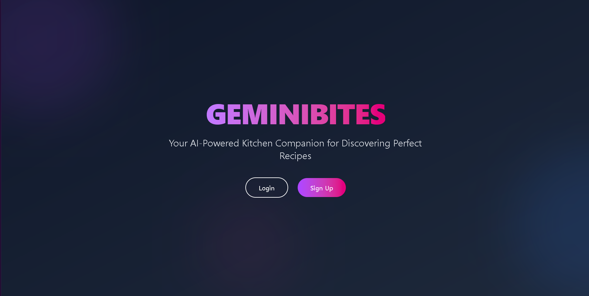
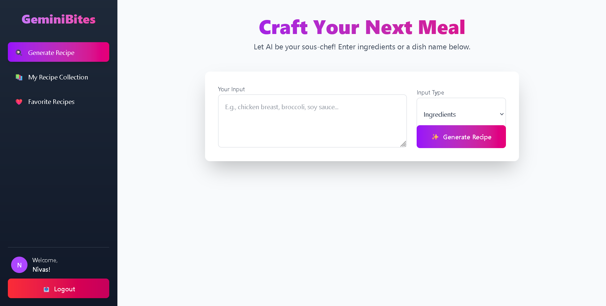
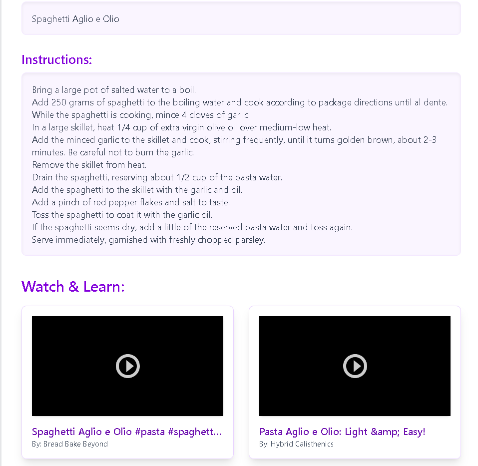
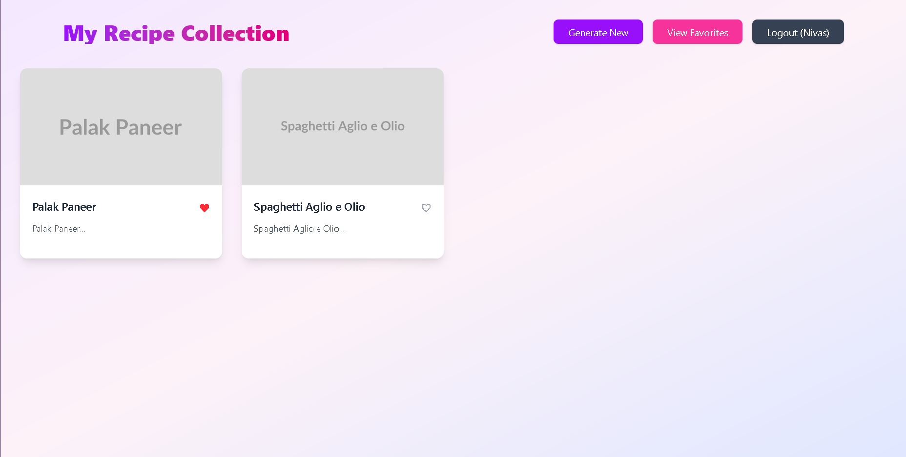
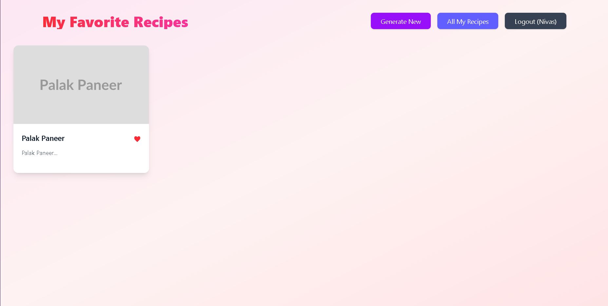

# GeminiBites

GeminiBites is an AI-powered kitchen companion application that helps users discover personalized recipes based on available ingredients, dietary preferences, and desired dishes.








## Features

- **AI-Powered Recipe Generation**: Generate personalized recipe suggestions based on available ingredients or desired dishes
- **Recipe Management System**: Save, categorize, and organize your recipe collection
- **Detailed Instructions**: Access clear, comprehensive cooking instructions for each recipe
- **Video Tutorial Integration**: Watch related cooking tutorials from YouTube
- **User Authentication**: Secure account system to save preferences and favorite recipes

## Technology Stack

- **Frontend**: React.js with Tailwind for styling
- **Backend**: Flask (Python)
- **AI Integration**: Google's Gemini AI for recipe generation
- **Authentication**: JWT-based authentication system
- **Database**: SQLite/PostgreSQL

## Installation

### Prerequisites
- Node.js (v16+)
- npm or yarn
- Python 3.9+

### Frontend Setup
1. Clone the repository
```bash
git clone https://github.com/yourusername/geminibites.git
cd geminibites/frontend
```

2. Install dependencies
```bash
npm install
```

3. Start the development server
```bash
npm run dev
```

### Backend Setup
1. Navigate to the backend directory
```bash
cd ../backend
```

2. Create and activate a virtual environment
```bash
python -m venv venv

# On Windows
venv\Scripts\activate

# On macOS/Linux
source venv/bin/activate
```

3. Install backend dependencies
```bash
pip install -r requirements.txt
```

4. Configure environment variables
```bash
# Create a .env file with the following configuration
FLASK_APP=app.py
FLASK_ENV=development
SECRET_KEY=your_secure_secret_key
GEMINI_API_KEY=your_gemini_api_key
```

5. Initialize the database
```bash
flask db init
flask db migrate
flask db upgrade
```

6. Start the backend server
```bash
flask run
```

## Usage

1. **Account Setup**: Create an account to access personalized features
2. **Recipe Generation**: Input available ingredients or desired dish names to generate recipes
3. **Recipe Management**: Save recipes to your collection and organize by favorites
4. **Meal Preparation**: Follow comprehensive step-by-step instructions


## License

This project is licensed under the MIT License - see the [LICENSE](LICENSE) file for details.

## Acknowledgements

- Google's Gemini AI platform for powering recipe generation capabilities
- Open-source libraries and frameworks that support this application
